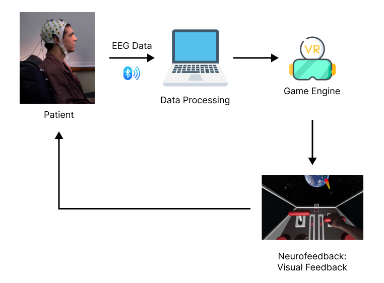

# neurofeedback_vr

The goal of this project is to develop a virtual reality (VR) neurofeedback rehabilitation system for Parkinson'n patients in a form of a game. The VR headset used for this project is Oculus Quest 2. All the components of the system are represented in the figure below.

This README file includes information regarding running the project. You can find more information regarding the project in the [Wiki](https://github.com/marteczkah/neurofeedback_vr/wiki/Brain-Computer-Interface-with-Virtual-Reality-Neurofeedback).

## Requirements 
- explorepy
- simplejson
- pyzmq
- numpy
- pandas
- mne
- sklearn
- scikit-learn
- matplotlib

## Basic Information and Setup

This project has two main components - Python and Unity - that are split into two folders:
* python_scripts - includes all the Python files,
* neurofeedback_vr - includes all the files from the Unity part of the project.

### python_scripts

#### Data Communication

The data can be acquired and communicated between Python and Unity using `send_exg_data.py` file. Change the the device name on line 38 to acquired the data from your EEG device and send it to Unity. The EEG data can be read in C# in a JSON format and deserialize into a list of lists. 

Another file responsible for communicating the data is `send_random_msgs.py`. By running the file you can communicate randomly generated states (left, right, rest) with Unity for the control of the gameplay. 

#### Classification

`classification.py` is a class that can be used for a classification of MNE raw data. A sample of how the class could be used is in the `classification_sample.ipynb`. `classification_random.py` is used to generate random states that are the same as the outputs of the intended classification task for this project. 

### neurofeedback_vr

The Python - Unity communication has been implemented based on the [Unity3D-Python-Communication](https://github.com/off99555/Unity3D-Python-Communication) repository. 

The most important file for the communication is `HelloRequester.cs`. To ensure proper communication, change the IP address at line 27 to the IP of your computer or the Oculus Quest 2 headset. The port should stay at 5555. If you decide to change the port number, make sure to also change it in the Python files (`send_exg_data.py`, `send_random_msgs.py`). 

The `BulletLeft.cs` and `BulletRight.cs` are the files responsible for the shooting action. In their current format they are triggered by the message coming from Python, signalizing the current state is the state that triggers the action or not. The file `BulletAction.cs` shows how to change the file, so that the action can be triggered by pressing a button on the controller, rather than on the message coming from Python.

## How to run?

After making all the changes described in the previous section you are ready to run the code. First, turn on one of the Python scripts responsible for listening for a trigger to send the message and sending the message itself (`send_exg_data.py`, `send_random_msgs.py`). Then, you can start the game in Unity and see the signals coming.

To see the game using the Oculus Quest 2 headset, you need to connect it to your machine through an USB-C wire. Make sure that your headset is in the developer mode. In Unity to go File>Buid Settings... In the settings, make sure that the `pistols` scene is selected. For the Platform select Android. Make sure you select your Oculus headset in the `Run Device` option. Then press `Build and Run`. After the built is completed, you can go to Apps in the headset and find your the built application there. Select it and run it. 
