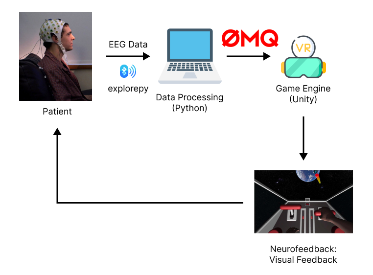

# neurofeedback_vr

The goal of this project is to develop a virtual reality (VR) neurofeedback rehabilitation system for Parkinson'n patients in a form of a game. All the components of the system are represented in the figure below.

This README file includes information regarding running the project. You can find more information regarding the implementation in the [Wiki](https://github.com/marteczkah/neurofeedback_vr/wiki/Brain-Computer-Interface-with-Virtual-Reality-Neurofeedback).

## Requirements 
- explorepy
- simplejson
- pyzmq
- numpy
- pandas
- mne
- sklearn
- scikit-learn
- matplotlib

## How to run?

This project has two main components - Python and Unity - that are split into two folders:
* python_scripts - includes all the Python files,
* neurofeedback_vr - includes all the files from the Unity part of the project.

### python_scripts

#### Data Communication

The data can be acquired and communicated between Python and Unity using `send_exg_data.py` file. Change the the device name on line 38 to acquired the data from your EEG device and send it to Unity. The EEG data can be read in C# in a JSON format and deserialize into a list of lists. 

Another file responsible for communicating the data is `send_random_msgs.py`. By running the file you can communicate randomly generated states (left, right, rest) with Unity for the control of the gameplay. 

#### Classification

`classification.py` is a class that can be used for a classification of MNE raw data. A sample of how the class could be used is in the `classification_sample.ipynb`. `classification_random.py` is used to generate random states that are the same as the outputs of the intended classification task for this project. 

### neurofeedback_vr

